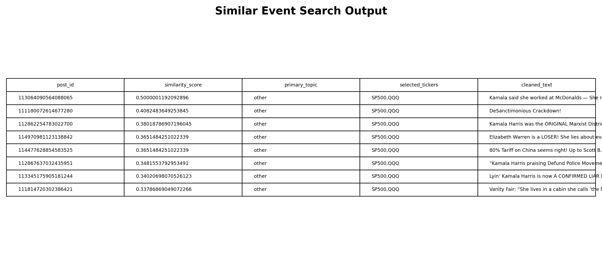

# Market Narrative Intelligence System

This project turns raw Truth Social posts into cleaned market narrative events, then adds validated structured classifications for downstream retrieval, DuckDB analysis, and Power BI exports.

## Technical Route

Keywords: `Python ETL`, `Parquet`, `pandas`, `DuckDB`, `ChromaDB`, `semantic search`, `embeddings`, `LLM-assisted classification`, `Pydantic validation`, `rule-based ticker mapping`, `FastAPI`, `React`, `Power BI`.

The project is built as a local analytics pipeline with a semantic search layer. Raw Truth Social post data is cleaned into event-level records, then each post is classified into a compact market narrative schema. The LLM is only used for structured labels such as topic, tone, entities, market relevance, and policy direction; asset selection stays rule-based, so the return analysis remains easier to audit.

The local database side keeps the structured event data: cleaned text, dates, engagement fields, narrative labels, selected tickers, and daily open-to-close returns. The vector database side keeps text embeddings plus lightweight metadata. At query time, ChromaDB finds similar historical posts first; DuckDB then uses those matched ids to pull the structured fields and calculate the market reaction.


Step outputs:

- Clean raw posts -> cleaned event records with ids, dates, text, engagement, and daily returns.
- Classify narratives -> topic, tone, entities, market relevance, and policy direction.
- Map assets -> selected tickers and return fields for each narrative type.
- Build vector index -> searchable text embeddings linked back to event ids.
- Retrieve matches -> similar event ids with similarity scores.
- Join and summarize -> similar posts, selected ticker returns, summary tables, charts, and dashboard-ready data.

## Run the ETL

```bash
python -m src.ingest \
  --raw-path data/raw/trump_truth_social.parquet \
  --output-path data/processed/cleaned_events.parquet
```

The ETL:

- enforces `post_id` presence and uniqueness
- keeps core post, engagement, media, category, and GDELT fields
- keeps only ticker `open` and `close` price columns from the market data
- creates `cleaned_text`
- adds engagement and text features
- calculates daily open-to-close returns as `<ticker>_daily_return`

Timestamp handling is explicit:

- timezone-aware raw `datetime` values are normalized to UTC
- naive raw `datetime` values are interpreted as `America/New_York`, then converted to UTC
- `date` is stored as a normalized pandas datetime column, not Python `datetime.date` objects

## Test

```bash
python -m pytest -q
```

## Run Classification

```bash
python -m src.classify \
  --input-path data/processed/cleaned_events.parquet \
  --output-path data/processed/classified_events.parquet \
  --checkpoint-every 1000
```

Set `OPENAI_API_KEY` in `.env` or your shell before running live LLM classification. For offline development or review:

```bash
python -m src.classify --fallback-only
```

The classifier validates every LLM response with Pydantic, retries once with a stricter prompt when validation fails, retries transient OpenAI API errors with backoff, checkpoints progress, and can resume an interrupted run:

```bash
python -m src.classify --resume
```

Fallback classifications use:

- `primary_topic = other`
- `tone = neutral`
- `entities = []`
- `market_relevance = low`
- `policy_direction = neutral`

## Run Ticker Mapping And Power BI Export

```bash
python -m src.export_powerbi
```

This adds deterministic `selected_tickers` and `selected_return_columns` fields based on `primary_topic`, updates `data/processed/classified_events.parquet`, and writes `data/processed/powerbi_export.csv`.

## Build And Search ChromaDB

```bash
python -m src.build_chroma --embedding-provider hashing
```

The build step indexes non-empty `cleaned_text` values into the `market_narrative_posts` collection, using `post_id` as the Chroma document id and storing date, datetime, topic, tone, entities, market relevance, policy direction, and president metadata. The `hashing` provider is a deterministic local fallback for development and tests; use OpenAI embeddings for real semantic quality.

Use OpenAI embeddings when `OPENAI_API_KEY` is configured:

```bash
python -m src.build_chroma --embedding-provider openai
```

`auto` tries OpenAI first and warns before falling back to local hashing. Search enforces that the query-time embedding provider matches the provider stored in the collection metadata. To append only missing ids during rebuilds:

```bash
python -m src.build_chroma --no-reset --resume --embedding-provider hashing
```

Search the local collection:

```bash
python -m src.semantic_search "China tariff threats" --top-k 5 --embedding-provider hashing
```

## Analyze Similar Events

```bash
python -m src.analytics "China tariff threats" --top-k 20 --embedding-provider hashing
```

This runs the M5 flow: semantic search returns ranked `post_id`s, DuckDB joins those ids back to `classified_events.parquet`, and the analytics layer computes average and median daily open-to-close returns for the tickers selected by the deterministic topic mapping.

## Build Dashboard Assets

```bash
python -m src.reporting --embedding-provider hashing
```

This builds Power BI-ready source tables, static dashboard preview screenshots, a dashboard specification, and resume bullets.

Power BI source tables:

- `reports/powerbi/tables/narrative_topic_counts.csv`
- `reports/powerbi/tables/posts_over_time_weekly.csv`
- `reports/powerbi/tables/tone_distribution.csv`
- `reports/powerbi/tables/policy_direction_distribution.csv`
- `reports/powerbi/tables/market_reaction_by_topic_ticker.csv`
- `reports/powerbi/tables/selected_ticker_distribution.csv`
- `reports/powerbi/tables/high_engagement_posts.csv`
- `reports/powerbi/tables/similar_event_search_output.csv`
- `reports/powerbi/tables/data_quality_summary.csv`

Preview screenshots:





Dashboard notes:

- Specification: `reports/powerbi/dashboard_spec.md`
- Resume bullets: `reports/resume_bullets.md`
- Current local classified data is fallback-only unless live LLM classification has been run with `OPENAI_API_KEY`, so topic/tone/policy-direction charts currently validate the pipeline rather than final narrative findings.

## Run API And Frontend

Start the FastAPI backend:

```bash
export API_EMBEDDING_PROVIDER=hashing
python -m uvicorn app.main:app --host 127.0.0.1 --port 8000
```

Start the React frontend:

```bash
cd frontend
npm install
npm run dev -- --port 5173
```

Then open `http://127.0.0.1:5173/`.

API endpoints:

- `GET /api/health`
- `GET /api/topics`
- `POST /api/analyze`

The backend applies a lightweight guardrail before retrieval. It refuses unrelated questions, security/prompt-injection requests, oversized inputs, and redacts obvious PII before analysis.
