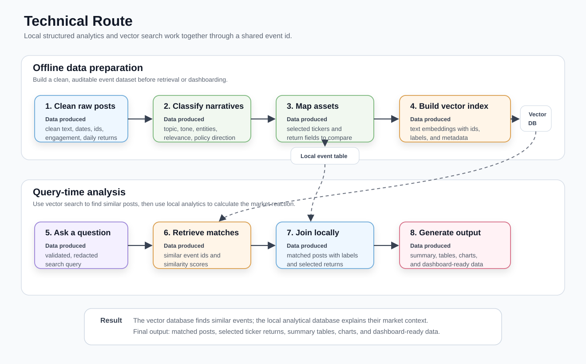
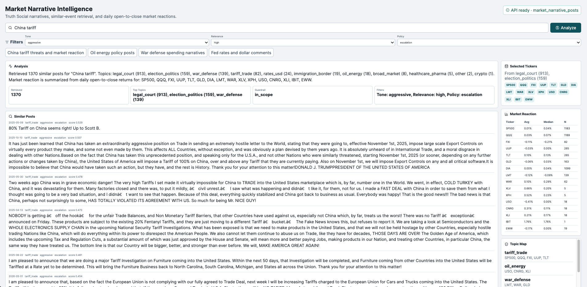
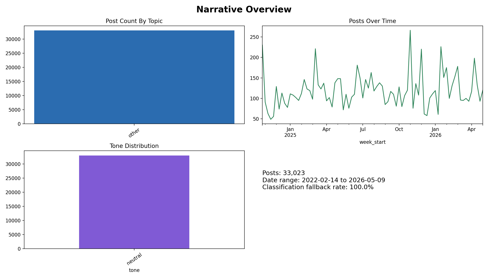
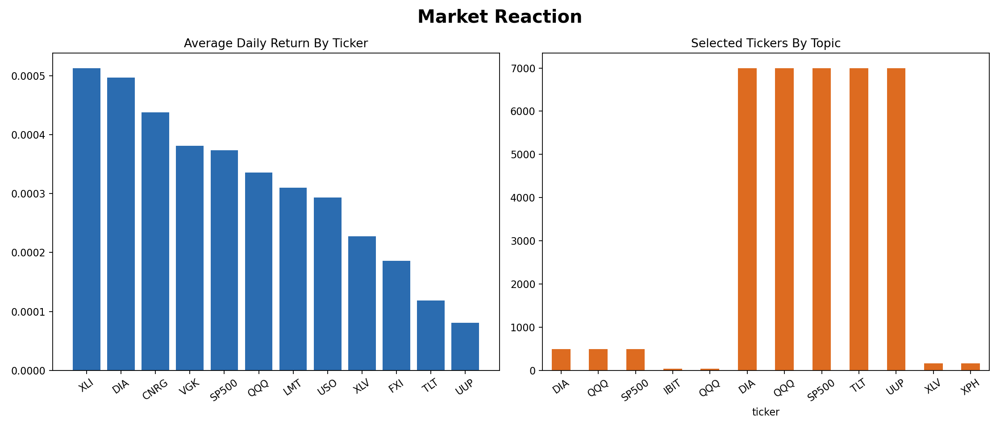
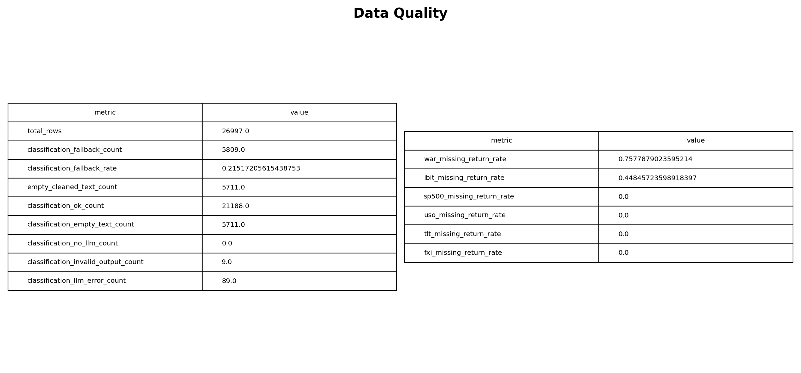

# Market Narrative Intelligence System

Market Narrative Intelligence turns Truth Social posts into searchable market narrative events, then connects similar historical posts to topic-specific ticker baskets and daily open-to-close market reactions.

## What It Does

- Cleans raw social posts into row-level event records with normalized timestamps, engagement fields, and daily ticker returns.
- Uses an LLM once for structured narrative labels: topic, tone, entities, market relevance, and policy direction.
- Maps each narrative topic to an auditable rule-based ticker basket, instead of asking the LLM to choose assets.
- Builds a ChromaDB semantic retrieval layer over cleaned retrieval text, with low-information retweet shells removed before embedding.
- Serves an interactive FastAPI + React search workspace for similar-event analysis and market-reaction summaries.
- Exports DuckDB/Power BI-ready tables and static dashboard previews.

## Technical Route

Keywords: `Python ETL`, `Parquet`, `pandas`, `DuckDB`, `ChromaDB`, `semantic search`, `embeddings`, `LLM-assisted classification`, `Pydantic validation`, `rule-based ticker mapping`, `FastAPI`, `React`, `Power BI`.

The project is built as a local analytics pipeline with a semantic search layer. Raw Truth Social post data is cleaned into event-level records, then each post is classified into a compact market narrative schema. The LLM is only used for structured labels such as topic, tone, entities, market relevance, and policy direction; asset selection stays rule-based, so the return analysis remains easier to audit.

The local database side keeps the structured event data: cleaned text, dates, engagement fields, narrative labels, selected tickers, and daily open-to-close returns. The vector database side keeps text embeddings plus lightweight metadata. At query time, ChromaDB finds similar historical posts first; DuckDB then uses those matched ids to pull the structured fields and calculate the market reaction.



Step outputs:

- Clean raw posts -> cleaned event records with ids, dates, text, engagement, and daily returns.
- Classify narratives -> topic, tone, entities, market relevance, and policy direction.
- Map assets -> selected tickers and return fields for each narrative type.
- Build vector index -> searchable text embeddings linked back to event ids.
- Retrieve matches -> similar event ids with similarity scores.
- Join and summarize -> similar posts, selected ticker returns, summary tables, charts, and dashboard-ready data.

## Frontend Walkthrough

The React frontend is a lightweight analyst workspace on top of the FastAPI retrieval endpoint. A user enters a market narrative question, optionally narrows retrieval by tone, market relevance, and policy direction, then reviews the matched posts, topic mix, ticker basket, and same-day market reaction summary in one view.



What the main panels show:

- Query bar: the natural-language market narrative to search.
- Filters: optional metadata filters for `tone`, `market_relevance`, and `policy_direction`. Topic is not a manual filter; it is shown as a result distribution after retrieval.
- Example queries: quick prompts for common narrative themes such as tariffs, oil and energy, defense spending, and rates.
- Analysis: a deterministic summary of retrieved post count, top retrieved topics, guardrail decision, and active filters.
- Similar Posts: the ChromaDB nearest-neighbor results, ordered by similarity score, with date, classified topic, tone, policy direction, score, and cleaned display text.
- Selected Tickers: the ticker basket mapped from the retrieved topic mix. The LLM does not choose these tickers; they come from the rule-based topic map.
- Market Reaction: average and median daily open-to-close returns for each selected ticker across the retrieved sample. `N` is the number of retrieved posts with usable return data for that ticker.
- Topic Map: the full rule-based mapping from narrative topic to ticker basket, shown so the asset-selection logic is transparent.

## Data Shape

Source: https://huggingface.co/datasets/chrissoria/trump-truth-social/viewer/default/train?p=4

The project keeps the dataset as row-level post events. The full files contain many ticker and return columns, so the table below shows the main column groups rather than every field.
Small 20-row Parquet samples are included under `data-sample/` so readers can inspect representative schemas without downloading the full local datasets. These samples filter out rows with blank key text fields; classified samples use successful `classification_status = ok` rows.

| Stage | File / Store | Approx. Shape | Main Fields | Purpose |
| --- | --- | ---: | --- | --- |
| Raw posts + market data | `data/raw/trump_truth_social.parquet` sample: `data-sample/trump_truth_social_sample.parquet` | source dataset | `post_id`, `datetime`, `text`, `content_html`, engagement counts, media/link fields, ticker open/close prices, ... | Original post and market-price source. |
| Cleaned events | `data/processed/cleaned_events.parquet` sample: `data-sample/cleaned_events_sample.parquet` | `26,997 x 75` | `post_id`, normalized `datetime/date/time`, `cleaned_text`, `total_engagement`, `text_length`, `has_url`, `<ticker>_open`, `<ticker>_close`, `<ticker>_daily_return`, ... | Canonical analytical event table after ETL. |
| Classified events | `data/processed/classified_events.parquet` sample: `data-sample/classified_events_sample.parquet` | `26,997 x 86` | all cleaned event fields plus `primary_topic`, `tone`, `entities`, `market_relevance`, `policy_direction`, `classification_reason`, `classification_status`, `selected_tickers`, `selected_return_columns` | Main local fact table used by DuckDB, API analysis, and Power BI export. |
| Power BI export | `data/processed/powerbi_export.csv` | dashboard subset | ids, dates, `cleaned_text`, engagement fields, classification fields, selected tickers, selected return columns, daily returns, ... | Flattened CSV for Power BI and static dashboard previews. |
| Vector index | `chroma_db/market_narrative_posts` | non-empty retrieval text rows | document id = `post_id`, document = retrieval text derived from `cleaned_text`, metadata = date, topic, tone, entities, market relevance, policy direction, president flag | Retrieval layer for semantic search and similar-event analysis. |

See `data-sample/README.md` for the exact sample files, including the `classified_events_gpt5mini_full` artifact before ticker-selection enrichment.

The LLM does not see the full dataframe. During classification, only `cleaned_text` is sent to the model, in batches of 10 posts. During retrieval, ChromaDB stores only the retrieval-text embedding plus lightweight metadata; DuckDB later joins the retrieved `post_id`s back to `classified_events.parquet` to recover the full structured row and market-return columns.

## Run the ETL

```bash
python -m src.ingest \
  --raw-path data/raw/trump_truth_social.parquet \
  --output-path data/processed/cleaned_events.parquet
```

The ETL:

- enforces `post_id` presence and uniqueness
- drops rows whose raw `text` is blank
- keeps core post, engagement, and media fields
- keeps only ticker `open` and `close` price columns from the market data
- creates `cleaned_text`
- adds engagement and text features
- calculates daily open-to-close returns as `<ticker>_daily_return`

Timestamp handling is explicit:

- timezone-aware raw `datetime` values are normalized to UTC
- naive raw `datetime` values are interpreted as `America/New_York`, then converted to UTC
- `date` is stored as a normalized pandas datetime column, not Python `datetime.date` objects

## Test

```bash
python -m pytest -q
```

## Run Classification

```bash
python -m src.classify \
  --input-path data/processed/cleaned_events.parquet \
  --output-path data/processed/classified_events.parquet \
  --batch-size 10 \
  --checkpoint-every 100
```

Set `OPENAI_API_KEY` in `.env` or your shell before running live LLM classification. For offline development or review:

```bash
python -m src.classify --fallback-only
```

The classifier sends posts in batches of 10 by default, validates every LLM response with Pydantic, retries once with a stricter prompt when validation fails, retries transient OpenAI API errors with backoff, checkpoints progress, and can resume an interrupted run:

```bash
python -m src.classify --resume
```

Fallback classifications use:

- `primary_topic = other`
- `tone = neutral`
- `entities = []`
- `market_relevance = low`
- `policy_direction = neutral`

## Run Ticker Mapping And Power BI Export

```bash
python -m src.export_powerbi
```

This adds deterministic `selected_tickers` and `selected_return_columns` fields based on `primary_topic`, updates `data/processed/classified_events.parquet`, and writes `data/processed/powerbi_export.csv`.

## Build And Search ChromaDB

```bash
python -m src.build_chroma --embedding-provider openai
```

The build step indexes non-empty retrieval text into the `market_narrative_posts` collection, using `post_id` as the Chroma document id and storing date, datetime, topic, tone, entities, market relevance, policy direction, and president metadata. Retrieval text is derived from `cleaned_text`; leading retweet shells such as `RT @realDonaldTrump` are stripped before embedding, and rows that become empty after that cleanup are skipped. The `hashing` provider is a deterministic local fallback for development and tests; use OpenAI embeddings for real semantic quality.

Embedding and retrieval flow:

1. `src.embeddings.create_embedding_provider(...)` chooses either OpenAI embeddings (`text-embedding-3-small` by default) or a deterministic local hashing embedding.
2. `src.build_chroma.build_chroma_collection(...)` embeds each non-empty retrieval text and upserts it into ChromaDB with `post_id` as the stable document id.
3. `src.semantic_search.search_similar_posts(...)` embeds the user's query with the same provider, checks that it matches the provider used to build the collection, and returns top-k nearest posts with similarity scores.
4. `src.analytics.analyze_similar_events(...)` uses those retrieved `post_id`s to join back to `classified_events.parquet`, then summarizes topics, selected tickers, similar posts, and daily open-to-close returns.

The local hashing embedding is useful for deterministic tests and offline demos, but it is lexical rather than semantic. For better conceptual matching, rebuild the collection with OpenAI embeddings and use the same provider at query time.

Use OpenAI embeddings when `OPENAI_API_KEY` is configured:

```bash
python -m src.build_chroma --embedding-provider openai
```

`auto` tries OpenAI first and warns before falling back to local hashing. Search enforces that the query-time embedding provider matches the provider stored in the collection metadata. To append only missing ids during rebuilds:

```bash
python -m src.build_chroma --no-reset --resume --embedding-provider openai
```

Search the local collection:

```bash
python -m src.semantic_search "China tariff threats" --top-k 5 --embedding-provider openai
```

## Analyze Similar Events

```bash
python -m src.analytics "China tariff threats" --top-k 20 --embedding-provider openai
```

This runs the M5 flow: semantic search returns ranked `post_id`s, DuckDB joins those ids back to `classified_events.parquet`, and the analytics layer computes average and median daily open-to-close returns for the tickers selected by the deterministic topic mapping.

Retrieved posts are then grouped into narratives at query time: `src.clustering` runs an in-house DBSCAN (no `sklearn` dependency) over the cosine distance between the embeddings ChromaDB already returns for the retrieved posts, so this adds no re-embedding and no re-classification, just a pass over vectors already in the collection. Posts that don't fit a dense cluster are flagged as noise and left out of the topic mix, ticker basket, and market-reaction aggregates, but they still appear in the similar-posts list so nothing silently disappears. `analyze_similar_events` and the `POST /api/analyze` endpoint expose this as `narratives`, `noise_count`, and `clustering_applied`, and each similar post carries a `cluster_label` (`null` when unclustered) and an `is_noise` flag. The clustering constants (`DBSCAN_MIN_SAMPLES`, `DBSCAN_EPS_QUANTILE`, `DBSCAN_EPS_FLOOR`, `DBSCAN_EPS_CEIL`, `CLUSTER_REP_TEXT_MAXLEN`) live in `src/config.py` and are tunable defaults meant to be recalibrated against the live index rather than fixed constants.

## Build Dashboard Assets

```bash
python -m src.reporting --embedding-provider openai
```

This builds Power BI-ready source tables, static dashboard preview screenshots, and a dashboard specification.

Power BI source tables:

- `reports/powerbi/tables/narrative_topic_counts.csv`
- `reports/powerbi/tables/posts_over_time_weekly.csv`
- `reports/powerbi/tables/tone_distribution.csv`
- `reports/powerbi/tables/policy_direction_distribution.csv`
- `reports/powerbi/tables/market_reaction_by_topic_ticker.csv`
- `reports/powerbi/tables/selected_ticker_distribution.csv`
- `reports/powerbi/tables/high_engagement_posts.csv`
- `reports/powerbi/tables/similar_event_search_output.csv`
- `reports/powerbi/tables/data_quality_summary.csv`

Preview screenshots generated from the current `gpt-5-mini` full-run classification artifact.
Narrative, ticker, and market-reaction views use rows where `classification_status = ok`;
the Data Quality view reports the full classified artifact, including empty-text and failed LLM rows.







Dashboard notes:

- Specification: `reports/powerbi/dashboard_spec.md`
- Current local classified data contains 21,188 validated LLM classifications out of 26,997 total rows; remaining fallback rows are primarily empty cleaned text, plus a small number of failed LLM batches.

## Run API And Frontend

Start the FastAPI backend:

```bash
export API_EMBEDDING_PROVIDER=openai
python -m uvicorn app.main:app --host 127.0.0.1 --port 8000
```

Start the React frontend:

```bash
cd frontend
npm install
npm run dev -- --port 5173
```

Then open `http://127.0.0.1:5173/`.

API endpoints:

- `GET /api/health`
- `GET /api/topics`
- `POST /api/analyze`

The backend applies a lightweight guardrail before retrieval. It refuses unrelated questions, security/prompt-injection requests, oversized inputs, and redacts obvious PII before analysis.
